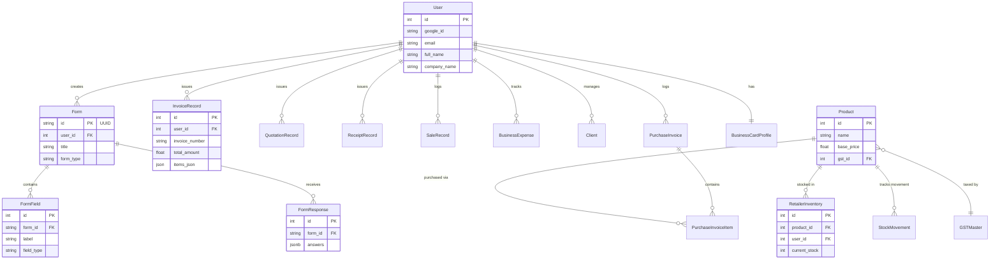

# Toolhub Naiyo Backend

Welcome to the **Toolhub Naiyo Backend** repository! This FastAPI-based backend powers the Toolhub Naiyo applications (Web and Mobile), providing a massive suite of utilities, document processing endpoints, business management features, AI tools, and a dynamic form builder.

---

## 📁 File Structure

The project follows a standard FastAPI structure designed for scalability and maintainability:

```
Toolhub_Naiyo_Backend/
├── alembic/              # Database migration configurations
├── core/                 # Core configuration, security, and settings
├── crud/                 # Database interaction logic (Create, Read, Update, Delete)
├── models/               # SQLAlchemy ORM database models
│   ├── business.py       # Inventory, invoicing, sales, clients, and business cards
│   ├── forms.py          # Dynamic form builder schema
│   ├── tool.py           # Core tool catalog schema
│   └── user.py           # User profiles and authentication
├── routes/               # API endpoints organized by feature sets
│   ├── ai_tools.py
│   ├── auth.py
│   ├── business_tools.py
│   ├── daily_utility.py
│   ├── docuforge.py      # PDF & Document operations
│   ├── file_tools.py
│   ├── finance_tools.py
│   ├── form_tools.py
│   ├── health_tools.py
│   ├── internet_tools.py
│   ├── productivity_tools.py
│   ├── social_tools.py
│   ├── student_tools.py
│   ├── tools.py
│   └── travel_tools.py
├── schemas/              # Pydantic models for request/response validation
├── templates/            # HTML templates (e.g., form viewer rendering)
├── uploads/              # Local storage for user-uploaded files
├── utils/                # Helper functions and external API wrappers
├── alembic.ini           # Alembic migration configuration
├── database.py           # Database connection and session setup
├── db.py                 # Simplified database engine initialization
├── dependencies.py       # FastAPI dependencies (auth, database sessions)
├── docker-compose.yml    # Docker Compose for running Postgres & PgAdmin
├── Dockerfile            # Docker configuration for the API
├── main.py               # Application entry point, CORS, and router registration
├── requirements.txt      # Python dependencies
└── seed_tools.py         # Initialization script for default database values
```

---

## 🌐 API Details

The API is comprehensively documented via FastAPI's automatic interactive docs. Once the server is running, visit `/docs` for Swagger UI or `/redoc` for ReDoc. Below is a high-level overview of the API groups:

*   **`/auth`**: User authentication, Google Login integration, and profile management.
*   **`/form-builder`**: Endpoints for creating dynamic forms, managing form fields, submitting responses, and exporting data (CSV).
*   **`/business-tools`**: Inventory management, product tracking, POS integrations, invoicing, receipt generation, client management, and sales analytics.
*   **`/docuforge`**: Comprehensive document processing, including PDF merging, splitting, compressing, OCR scanning, and resume building.
*   **`/ai-tools`**: AI-powered features such as meeting summarization, email writing, grammar checking, and prompt generation.
*   **`/student-toolkit`**: Tools for students including CGPA/SGPA calculators, study planners, assignment tracking, and flashcards.
*   **`/daily-utility`**: Everyday converters, calculators (EMI, SIP, Discount, Age, BMI), and QR/Barcode generation.
*   **`/finance-tools`** & **`/health-tools`**: Specialized domain calculators.
*   **`/file-tools`**: ZIP extraction/creation, file sharing, duplicate analysis, and storage management.
*   **`/internet-tools`**: Ping tests, DNS lookups, URL shortening, IP lookups, and website status checks.

---

## 🗄 Database Details

The backend utilizes **PostgreSQL** with SQLAlchemy ORM. The data model is divided into several domains: Users, Business Management, Dynamic Forms, and Core Tools.

### Tables Overview

| Table Name | Description |
| :--- | :--- |
| **`users`** | Core user profiles, Google authentication IDs, and basic business settings. |
| **`tools`** | Catalog of all available mini-tools in the system. |
| **`forms`** | Custom forms generated via the Form Builder. |
| **`form_fields`** | Individual questions/fields tied to a specific `form`. |
| **`form_responses`** | Submitted answers linked to a `form`. |
| **`products`** | Business catalog items with pricing, GST info, and imagery. |
| **`retailer_inventory`** | Real-time stock counts mapping products to specific retailers, including expiry dates and batch numbers. |
| **`stock_movements`** | Audit trail of inventory changes (Purchases vs. Sales). |
| **`sales_records`** | Logs of individual retail sales transactions. |
| **`invoice_records`** | Formal invoices generated for clients, storing itemized JSON and PDF links. |
| **`purchase_invoices`** | Formal purchase logs from suppliers. |
| **`purchase_invoice_items`** | Line-item details of purchases tied to the `products` table. |
| **`quotation_records`** | Client estimates and quotes. |
| **`receipt_records`** | Payment acknowledgments for accounting. |
| **`business_expenses`** | Operational expense logs for business owners. |
| **`clients`** | Business client CRM storage (address, GSTIN, phone). |
| **`business_cards`** | Digital business card profiles. |
| **`gst_master`** | Pre-configured GST tax slabs. |

### Entity Relationship Diagram (ERD)



---

## 🚀 Setup & Installation

1. **Clone the repository.**
2. **Start the database:**
   ```bash
   docker-compose up -d
   ```
   This spins up PostgreSQL on port `5432` and PgAdmin on port `5050`.
3. **Set up Python Virtual Environment:**
   ```bash
   python3 -m venv venv
   source venv/bin/activate
   pip install -r requirements.txt
   ```
4. **Environment Variables:**
   Copy `.env.example` to `.env` and fill in necessary secrets (like JWT keys, OAuth keys).
5. **Run Migrations (Alembic):**
   ```bash
   alembic upgrade head
   ```
6. **Start the Application:**
   ```bash
   uvicorn main:app --reload --host 0.0.0.0 --port 8000
   ```
ffff